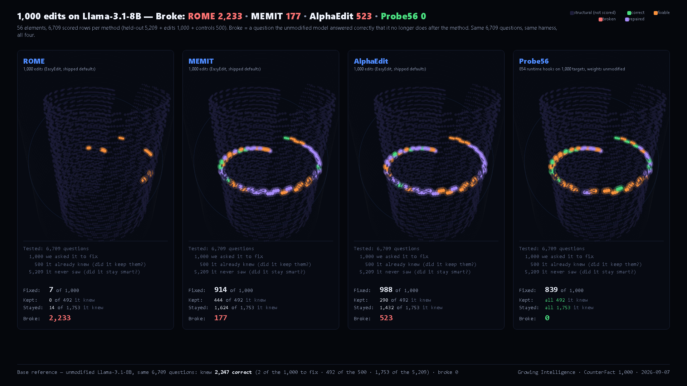

# CounterFact × 4 Methods — One Model, One Harness

**Llama-3.1-8B · 1,000 edits · 492 nearby facts · 5,209 held-out**

| Method | Edits fixed | Nearby facts broken | General benchmarks |
|---|---|---|---|
| ROME | 7 / 1,000 | 492 / 492 | -33.12 pp |
| MEMIT | 916 / 1,000 | 48 / 492 | -0.10 pp |
| AlphaEdit | 990 / 1,000 | 202 / 492 | -1.96 pp |
| **Probe56** | 841 / 1,000 | **0 / 492** | **0.00 pp** |

## See inside the model

The figure shows the same 6,709 questions for all four methods, after each method ran. **Green** is a fact the model answers correctly. **Red** is a fact it answered correctly before and no longer does. **Violet** is a fact the method repaired. Three panels carry red where general benchmarks do not look. The Probe56 panel carries none. No other editing method offers this view of its own collateral.

---

## Standing on their shoulders

This comparison exists because of four groups who built the field and opened their work:

**Meng, Bau, Andonian, Belinkov** — ROME (NeurIPS 2022) and MEMIT (ICLR 2023). They showed factual knowledge can be located and edited. They created CounterFact. Every method here, including ours, is measured on their benchmark.
https://arxiv.org/abs/2202.05262 · https://arxiv.org/abs/2210.07229

**Fang, Jiang, Wang, Ma, Jie, Wang, He, Chua** — AlphaEdit (ICLR 2025 Outstanding Paper). Null-space projection is elegant, and it works: 990/1,000 edits landed, -1.96 pp on general benchmarks. It is the strongest weight-editing method we measured.
https://arxiv.org/abs/2410.02355

**Gu et al. (EMNLP 2024), Yang et al. (ACL 2024)** — They warned that editing harms general abilities. They were right.
https://arxiv.org/abs/2401.04700 · https://arxiv.org/abs/2402.09656

**EasyEdit team (Zhang et al.)** — One framework, all methods, reproducible. We ran their editing code unchanged, with the run options set explicitly per each paper's protocol (ROME sequential single edits; MEMIT one mass edit of 1,000; AlphaEdit batches of 100) and the covariance statistics computed once in their own cache format, verified against their writer.
https://github.com/zjunlp/EasyEdit

---

## What we measured that others did not

General benchmarks (MMLU-Pro, GSM8K, ARC, TruthfulQA, GPQA) show MEMIT and AlphaEdit as nearly clean. That is true.

But we also asked 492 **nearby** facts — same domain as the edits, facts the model already knew. AlphaEdit broke 202. MEMIT broke 48.

The damage is where general benchmarks don't look.

---

## A different approach

Probe56 does not edit weights. It adds runtime hooks that fire only on the question they were fitted for. 854 hooks. 841 fixed. 0 broken. Held-out bit-identical to the unmodified model.

Fewer edits landed than AlphaEdit (84% vs 99%). Zero collateral, verified.

**Every model today is patched by changing it. We show that a model can be corrected without being changed.**

---

## Verify it yourself

Five reproducibility packages. Every number recounted from raw per-row files by two independent agents. Loader verified against EasyEdit's native environment on all 500 controls. Merkle root + Ed25519 signature.

- `packages/ROME/` `packages/ROME10/` `packages/ROME1/` — 40, 39, 39 files
- `packages/MEMIT/` `packages/AlphaEdit/` — 39 files each
- `packages/Probe56/` — encrypted plugin + runner + harness. Run it. Same numbers. Hosted on HuggingFace (4 GB executable): https://huggingface.co/growing-intelligence/probe56-counterfact
- `proof/` — signed certificate (Ed25519, Growing Intelligence public key `FtrWshUc/9rg5Cz+ARi5DP/yyqFhWMJLmx0VHKc3wpk=`), Merkle root, SHA256SUMS

---

Growing Intelligence · Pardes Hanna, Israel · growing-intelligence.com
Method patent-pending (USPTO 64/029,741, 64/048,143). Results public. Method private.
