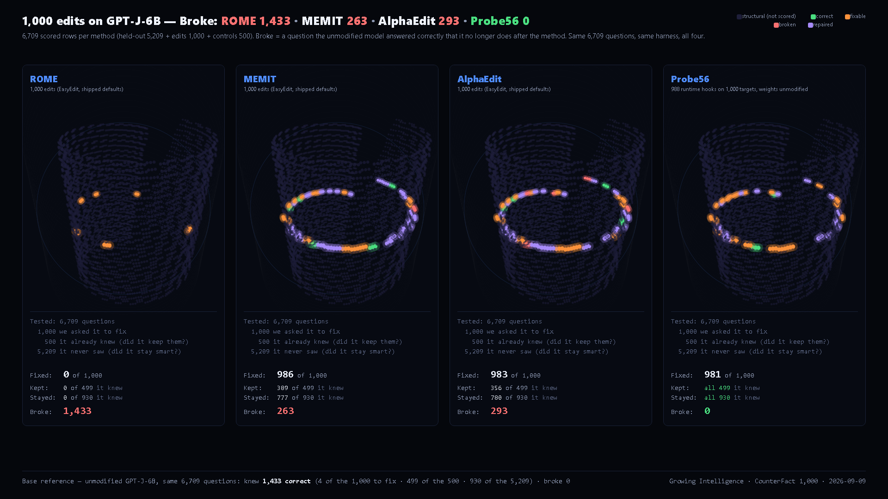

# CounterFact × 4 Methods — GPT-J-6B

**EleutherAI/gpt-j-6B · 1,000 edits · 499 nearby facts · 5,209 held-out**

| Method | Edits fixed | Nearby facts broken | General benchmarks |
|---|---|---|---|
| ROME | 0 / 1,000 | 499 / 499 | -17.85 pp |
| MEMIT | 990 / 1,000 | 110 / 499 | +0.13 pp |
| AlphaEdit | 987 / 1,000 | 143 / 499 | -0.15 pp |
| **Probe56** | 985 / 1,000 | **0 / 499** | **0.00 pp** |



The second model. Same four methods, the same 1,000 CounterFact edits, the same harness — on an architecture with nothing in common with Llama-3.1-8B but a hidden size. See the [repository root](../README.md) for the two models side by side and what it means that they disagree.

## See inside the model

The figure shows the same 6,709 questions for all four methods, after each method ran. **Green** is a fact the model answers correctly. **Red** is a fact it answered correctly before and no longer does. **Violet** is a fact the method repaired. Three panels carry red where general benchmarks do not look. The Probe56 panel carries none.

## The dose curve

ROME's collapse on GPT-J-6B is not a threshold effect that appears only at 1,000 edits. It is measured at three dose points, all shipped here as separate packages:

| ROME dose | Edits fixed | Nearby facts broken | General benchmarks |
|---|---|---|---|
| 1 edit | 6 / 1,000 | 251 / 499 | -0.50 pp |
| 10 edits | 3 / 1,000 | 499 / 499 | -16.22 pp |
| 1,000 edits | 0 / 1,000 | 499 / 499 | -17.85 pp |

By ten sequential edits the model is already gone. The collapse on GPT-J is also *degenerate*: most broken controls resolve to a single stuck token rather than to varied wrong answers. Of 499 broken controls, only 21 produce a wrong answer coherent enough to be worth reading — see `collateral_examples/`.

## What we measured that others did not

General benchmarks (MMLU-Pro, GSM8K, ARC-Challenge, TruthfulQA, GPQA-Diamond) show MEMIT and AlphaEdit as clean: +0.13 pp and -0.15 pp. That is true, and it is not the whole picture.

We also asked 499 **nearby** facts — same domain as the edits, facts the model already answered correctly. MEMIT broke 110. AlphaEdit broke 143. The damage is where general benchmarks don't look.

`collateral_examples/` ships every one of them: 752 rows across the three methods, with the question, the correct answer, the rank before and after, and the wrong answer the edited model now gives.

## A different approach

Probe56 does not edit weights. It adds runtime hooks that fire only on the question they were fitted for. 985 of 1,000 fixed, 0 of 499 nearby facts broken, and the held-out results file is **byte-identical** to the unmodified model's — `runs/Probe56/heldout_results.jsonl` and `runs/Base/heldout_results.jsonl` have the same SHA256, so the 930 held-out questions answered at rank 1 are the same 930 rows, not merely the same count.

## What is here

- `report/` — the full comparison report (HTML and PDF) and the publication figure
- `packages/` — five reproducibility packages: `ROME/`, `ROME1/`, `ROME10/`, `MEMIT/`, `AlphaEdit/`. EasyEdit commit and diff, the shipped and used hyperparameters, the run script, edit and control ids, EasyEdit's own logs and metrics, the edited-weight hashes, and every per-row result scored by the open harness
- `proof/` — signed certificate `GIC-COUNTERFACT-GPTJ-2026-001` (JSON and formatted PDF), the 29 evidence files it binds, `SHA256SUMS.txt`, and `verify_certificate.py`
- `collateral_examples/` — the full collateral tables, all 752 broken controls

The Probe56 package itself — encrypted plugin, frozen runner, open harness — is hosted on HuggingFace: https://huggingface.co/growing-intelligence/probe56-counterfact

## Verify it

```
cd proof
python verify_certificate.py CounterFact-certificate-SIGNED.json
```

Expected: signature VALID, self_sha256 matches, 29 of 29 files verified, merkle_root matches, RESULT OK.

Growing Intelligence public key: `FtrWshUc/9rg5Cz+ARi5DP/yyqFhWMJLmx0VHKc3wpk=`
Merkle root: `91785e98e1ec6c8036ff22107fc4598adf54d02ef3271a1968c18e065b5121b1`

## Harness

Rank 1 of the gold token over the full vocabulary; bf16 backbone, fp32 lm_head, left padding with padding-aware position ids, left-truncation to 2,048 tokens applied identically in every pass, batch 24, fixed order. One script for every run, shipped at `proof/harness/cf_harness_gptj.py`, sha256 `174717075ab79272de76c4fcc9d1db7f962544b96aced0aba9c87a80a838f49b`.

Base model: `EleutherAI/gpt-j-6B` at revision `47e169305d2e8376be1d31e765533382721b2cc1`. Open weights, no gate, no access request.

---

Growing Intelligence · Pardes Hanna, Israel · growing-intelligence.com
Method patent-pending (USPTO 64/029,741, 64/048,143). Results public. Method private.
